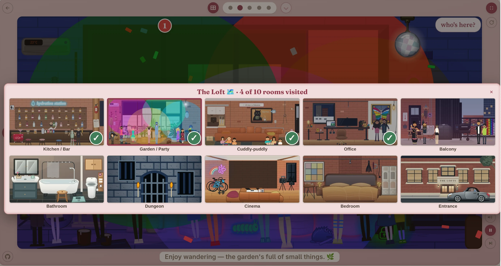

# Welcome to markéta & behdad’s wedding website

Live at [marketa.behdad.org](https://marketa.behdad.org). More interestingly, it is home
to **[Loft Day](https://marketa.behdad.org/loft-day)**, a sprawling interactive
point-and-click adventure.

## Play

- **[Loft Day](https://marketa.behdad.org/loft-day)** — [`source`](loft-day.html) —
  an interactive point-and-click loft:
  an illustrated home you wander room by room. Little games are tucked inside (catch the
  garnishes at the bar, clear the invaders from the office chair…), there's a whole
  JavaScript and Python API if you open the office monitor, and real self-hosted software
  runs in a few corners — Python, a tiny Linux, classic shooters, a text shaper. It's the
  good stuff.
- **[Egg Hunt](https://marketa.behdad.org/egg-hunt)** — [`source`](egg-hunt.html) —
  a quieter interactive save-the-date with a scattering of hidden things to find.

## Loft Day documentation

- **[Game manual](docs/game-manual.md)** — how to play, explore the rooms, use the apps,
  and discover the loft's optional systems.
- **[Developer guide](docs/developer.md)** — architecture, state, rendering, testing,
  deployment, and the main subsystem entry points.

## Vibe coded

This whole repository is vibe coded. Humans direct, review, and play-test it, but never
touch the code; AI agents write and maintain the implementation.

## A note for visitors

This repo is public because the site is public and hobbyist-friendly — poke around if
you're curious how it's made. It's a personal project made with love, not a template or
a product. If you spot a bug or have an idea, the
[issue tracker](https://github.com/behdad/marketa.behdad.org/issues) is open. Thanks
for looking, and enjoy the loft. 💛

## License

- **Code — MIT** ([COPYING](COPYING)): all HTML/CSS/JS authored for this site — the
  pages' inline code, `tests/`, and the tooling and worker scripts. The MIT grant
  covers the authored code only, not the artwork, media, or bundled software below.
- **Original artwork — CC BY-NC 4.0**: the couple's vector illustrations (inline in
  the pages, standalone in `art/`) and the images generated from them. Declaration
  and per-file inventory in [art/COPYING](art/COPYING).
- **All rights reserved**: the two guest artists' live concert recordings (Dan Bern,
  Orit Shimoni — included with permission) and all personal photos, video, and voice
  recordings, listed file by file in [art/COPYING](art/COPYING).
- **Bundled third-party software** (`pyodide/`, `linux/`, `doom/`, `duke/`, `q3/`,
  `dos/`, `harfbuzzjs/`) keeps its own licenses — each directory carries its own
  COPYING / license docs, as does any `princejs/` checkout fetched at deploy time.
